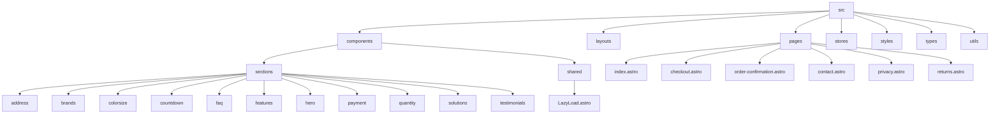
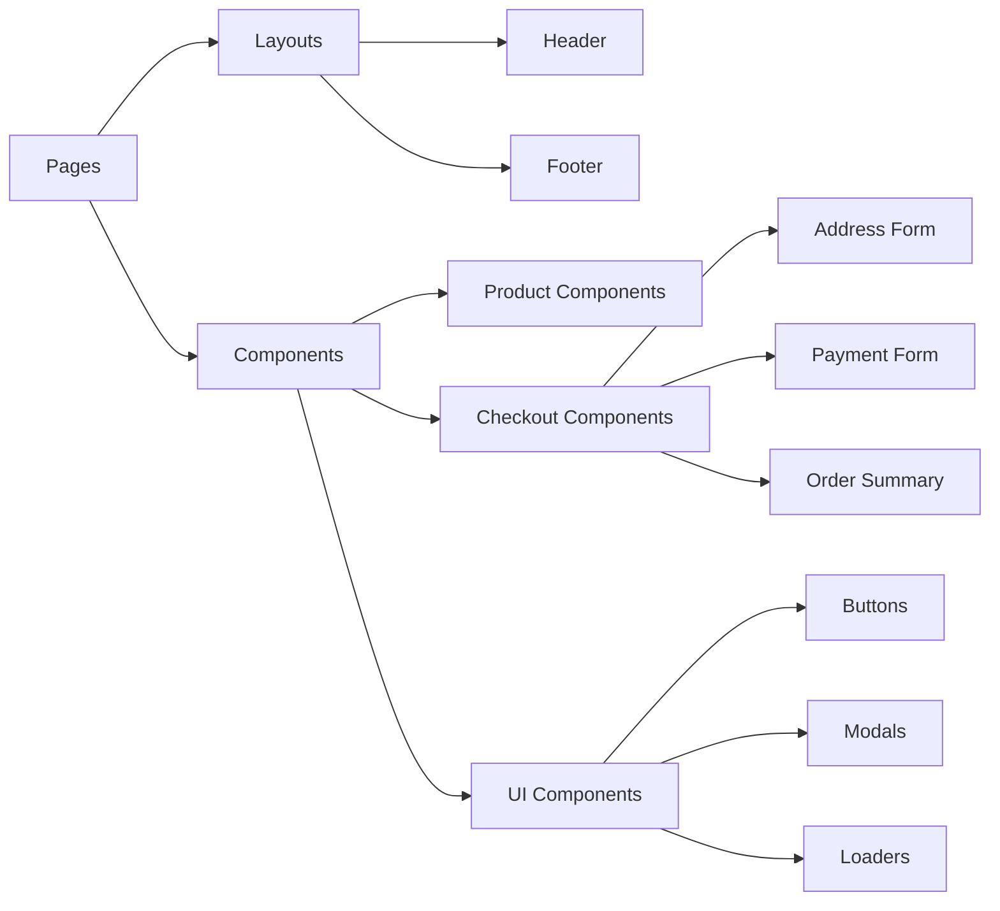
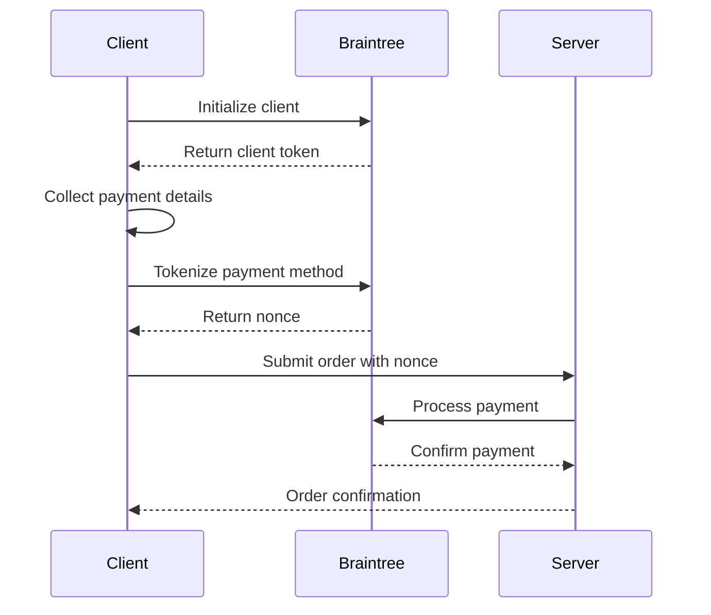

# Agency Template - E-commerce Platform

> **Performance Optimized** 🚀 - This template includes advanced performance optimizations including code splitting, lazy loading, and efficient resource loading strategies.

## Overview
This is a modern e-commerce platform built with Astro, SolidJS, and Braintree for payment processing. The application is designed as a template for an agency to quickly deploy and customize for clients, particularly for selling physical products like barefoot shoes.

## Technology Stack

### Core Technologies
- **Frontend Framework**: Astro (v5.2.3)
- **UI Framework**: SolidJS (v1.9.3)
- **Styling**: Tailwind CSS (v3.4.1)
- **Payment Processing**: Braintree (v3.30.0)
- **Form Handling**: Custom form components with validation
- **Build Tool**: Vite (via Astro)

### Performance Features
- **Code Splitting**: Automatic route-based code splitting
- **Lazy Loading**: On-demand loading of components and assets
- **Resource Hints**: Preload, prefetch, and preconnect for critical resources
- **Optimized Builds**: Tree-shaking and minification
- **Efficient Hydration**: Selective hydration for interactive components

### Development Tools
- **TypeScript**: For type safety
- **ESLint**: Code linting
- **Prettier**: Code formatting
- **Husky**: Git hooks
- **Testing**: (Not yet implemented)

## Project Structure



## Key Features

### 1. Product Showcase
- Hero section with featured products
- Product categories and filtering
- Detailed product views

### 2. Shopping Experience
- Product selection with quantity controls
- Color and size selection
- Real-time price updates
- Promotional countdown timers

### 3. Checkout Process
- Multi-step checkout flow
- Address collection with validation
- Braintree payment integration
- Order confirmation

### 4. Post-Purchase
- Order confirmation page
- Order tracking
- Customer support information

## Architecture

### Frontend Architecture


### Payment Flow


## Component Structure

### Core Components
1. **Layouts**
   - `Layout.astro`: Base layout
   - `Layout-Checkout.astro`: Checkout-specific layout
   - `Layout-Home.astro`: Homepage layout

2. **Pages**
   - `index.astro`: Homepage
   - `checkout.astro`: Checkout process
   - `order-confirmation.astro`: Order success page
   - `contact.astro`: Contact information
   - `privacy.astro`: Privacy policy
   - `returns.astro`: Return policy

3. **Sections**
   - `Hero`: Main banner with CTA
   - `Brands`: Partner/featured brands
   - `FAQ`: Frequently asked questions
   - `Solutions`: Product solutions
   - `Testimonials`: Customer reviews
   - `Features`: Product features
   - `Payment`: Payment forms and processing
   - `Address`: Address collection
   - `Quantity`: Product quantity selector
   - `ColorSize`: Product variant selection

## State Management

The application uses a combination of:
- Component-level state (using SolidJS)
- URL parameters
- LocalStorage for persistence
- Custom event system for cross-component communication

## Payment Integration

The application integrates with Braintree for payment processing:
- Secure credit card tokenization
- Device data collection for fraud prevention
- Error handling and validation
- Support for multiple payment methods

## Development Setup

1. Clone the repository
2. Install dependencies:
   ```bash
   npm install
   ```
3. Create a `.env` file based on `.env.example`
4. Start the development server:
   ```bash
   npm run dev
   ```
5. Build for production:
   ```bash
   npm run build
   ```
6. Analyze bundle size:
   ```bash
   npm run build:stats
   ```
   This will generate a `stats.html` file in the `dist` directory for bundle analysis.

## Deployment

The application includes a `render.yaml` configuration for deployment to Render.com. It can also be deployed to other platforms that support Node.js applications.

## Performance Optimizations

### Implemented
1. **Code Splitting**
   - Route-based code splitting with Astro
   - Dynamic imports for heavy components (Testimonials, FAQ)
   - On-demand loading of Braintree SDK

2. **Lazy Loading**
   - Image lazy loading with `loading="lazy"`
   - Component-level lazy loading with Intersection Observer
   - Deferred loading of non-critical resources

3. **Resource Optimization**
   - Critical CSS inlining
   - JavaScript execution optimization
   - Efficient event delegation

4. **Third-party Scripts**
   - Deferred loading of analytics
   - Lazy initialization of non-essential scripts
   - Resource hints for external domains

### Future Improvements
1. **Testing**: Add unit and integration tests
2. **Accessibility**: Improve ARIA labels and keyboard navigation
3. **Analytics**: Add tracking for user behavior
4. **CMS Integration**: Add support for headless CMS
5. **Internationalization**: Add multi-language support
6. **Progressive Web App**: Add service workers for offline support
7. **Image Optimization**: Implement responsive images and WebP format

## License

[Specify License]

---

*This document was generated automatically based on the current state of the repository.*
